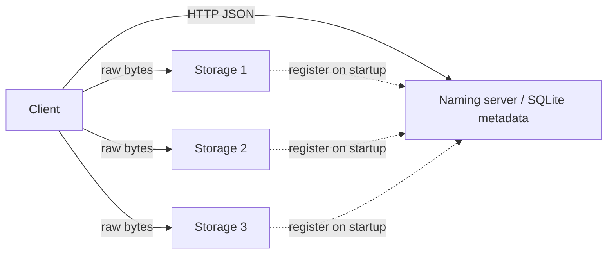
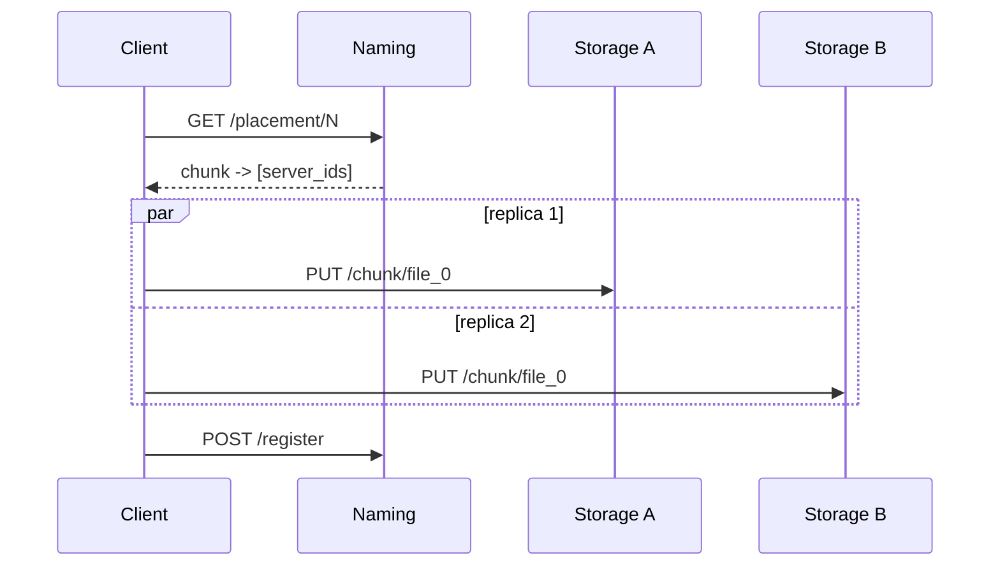

# Architecture

This project implements a small distributed file system for text files with:
- 1 KB fixed chunking
- replication factor 2
- one naming server for metadata
- multiple storage servers for chunk bytes

Contract reference: [CONTRACT.md](../CONTRACT.md).

## Component Overview

## Why This Design

- **Metadata and data are separated.** The naming server stores metadata tables (`files`, `chunks`, `storage_servers`) and never stores chunk bytes, as defined in `init_db()` in [naming_server/app.py](../naming_server/app.py).
- **Fixed-size chunks simplify placement.** The 1 KB contract size gives uniform chunk units for round-robin placement and reassembly.
- **Placement is intentionally simple.** `GET /placement/{num_chunks}` assigns replicas with round-robin over registered storage IDs in [naming_server/app.py](../naming_server/app.py) (`placement()`).
- **Chunk writes are atomic on storage nodes.** `save_chunk()` writes to a temp file and then calls `os.replace(...)` in [storage_server/storage.py](../storage_server/storage.py), preventing half-written visible chunks.

## Write Path

## Read Path

- Client requests locations from `GET /locate/{file}` on the naming server.
- Naming returns chunk indices with storage IDs/URLs from metadata in [naming_server/app.py](../naming_server/app.py) (`locate()`).
- Client fetches chunk bytes from storage servers with `GET /chunk/{id}` from [storage_server/main.py](../storage_server/main.py).
- If one replica is unavailable, the contract requires trying the other replica before failing ([CONTRACT.md](../CONTRACT.md)).

## Deliberate Non-Goals In This Build

- No automated re-replication after a storage node failure.
- No metadata replication for the naming server.
- No chunk checksum verification in storage APIs.
- No authn/authz layer in service endpoints.
