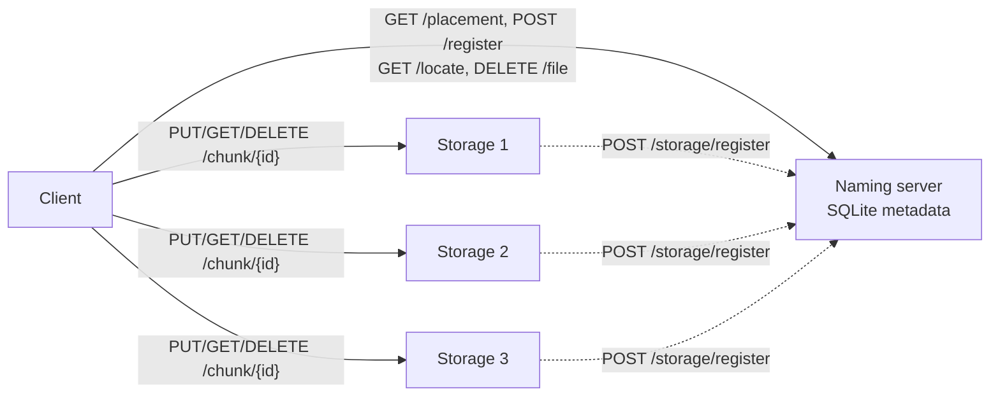
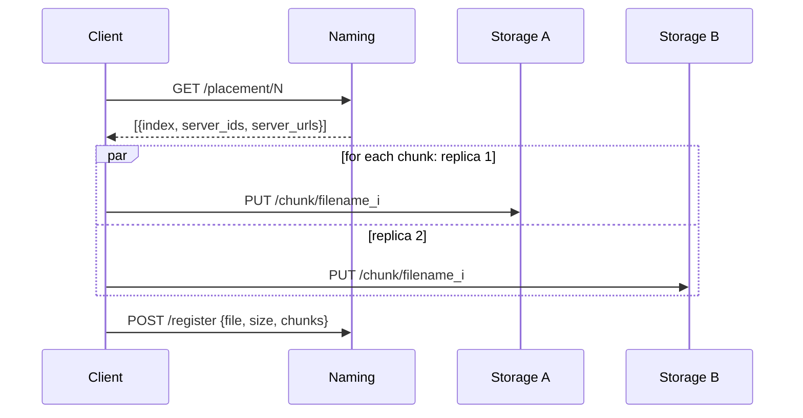

# Architecture

Contract reference: [CONTRACT.md](../CONTRACT.md).

## Component Overview

**Naming server** (`naming_server/app.py`) — metadata authority. Owns `files`, `chunks`, and `storage_servers` tables in SQLite. Never stores chunk bytes.

**Storage servers** (`storage_server/`) — raw bytes on disk. Each node self-registers with naming on startup via a background task (`_register_with_naming`, `storage_server/main.py:35–69`), retrying up to 10 times so a slow naming startup never blocks chunk serving.

**Client** (`client.py`, `client_logic.py`) — splits files, drives placement and replication, reassembles on read.

## Design Decisions

- **Metadata/data split.** Naming holds only chunk-to-server mappings; storage holds only bytes. Keeps naming small and SQLite-viable.
- **Fixed 1 KB chunks.** Uniform size makes round-robin placement equal-weight and makes reassembly index-driven. Cost: metadata row per chunk; acceptable for the text-file scope of this project.
- **Naming server owns placement.** The client always fetches placement from `GET /placement/{n}` (`naming_server/app.py:94–108`) rather than maintaining a local server list. Adding a storage replica only requires registering it.
- **Atomic writes on storage.** `save_chunk()` (`storage_server/storage.py:52–77`) writes to a temp file then calls `os.replace()`, so a process crash cannot leave a half-written chunk visible.
- **Atomic reads on client.** `read_file()` (`client_logic.py:424–432`) assembles chunks into a temp file, then calls `os.replace()` so an interrupted download never corrupts the output path.

## Write Path

If any chunk upload fails, `_cleanup_uploads()` (`client_logic.py:217–226`) attempts best-effort deletion of already-uploaded chunks before raising.

## Read Path

- `GET /locate/{file}` returns chunk list with `server_ids` and `server_urls`.
- Client fetches each chunk via `_fetch_chunk()` (`client_logic.py:362–390`), trying replicas in order. Network errors, timeouts, and 5xx responses trigger a retry on the next replica. Only 404 with no remaining replicas is a hard failure.

## Delete Path

- `DELETE /file/{file}` on naming drops metadata and returns chunk IDs with server locations.
- Client fires `DELETE /chunk/{id}` on every listed replica; network failures are logged and skipped (best-effort).

## Docker Layout

`docker-compose.yml` runs 1 naming + 3 storage servers + an on-demand client container. Naming metadata (`naming-db` volume) and each storage node's chunks (`storageN-data` volumes) persist across restarts. Storage containers have healthchecks; the client `depends_on` all of them being healthy before it runs.

## Deliberate Non-Goals In This Build

- No automated re-replication after a storage node failure.
- No metadata replication for the naming server.
- No chunk checksum verification.
- No authn/authz layer.
