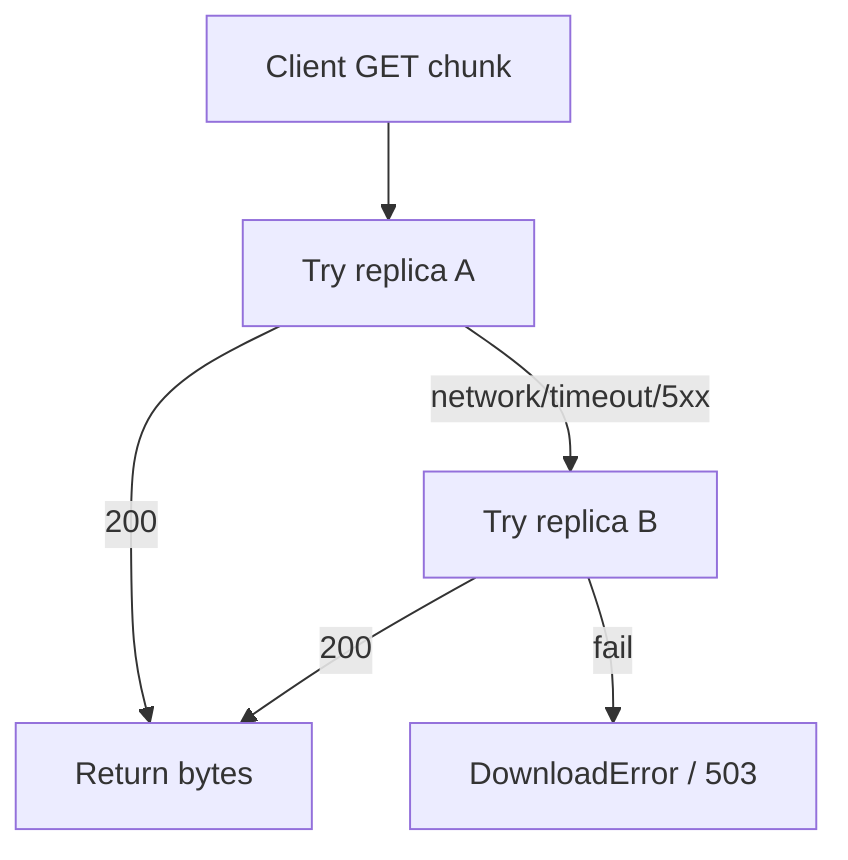

# Fault Tolerance Analysis

References: [CONTRACT.md](../CONTRACT.md), `naming_server/app.py`, `storage_server/main.py`, `storage_server/storage.py`, `client_logic.py`

## Q1: One Storage Server Is Down

**Reads** — `_fetch_chunk()` (`client_logic.py:362–390`) tries each replica URL in order. A network error, timeout, or 5xx response moves to the next replica without failing the read. Only when all replicas for a chunk fail does it raise `DownloadError`. With RF=2, one downed node means one replica per chunk survives and reads complete normally.

**Writes (new uploads)** — `GET /placement/{n}` (`naming_server/app.py:101–102`) returns 503 when the live pool is smaller than `REPLICATION_FACTOR`. A single failed node drops the pool from 3 to 2; with `REPLICATION_FACTOR=2` that still satisfies the check, so new writes continue. If the pool drops below RF, placement is refused.

**Already-stored data** — chunk files on surviving nodes are untouched. When the failed node restarts, it re-registers with naming and its chunks are immediately available again.

**Empirical evidence** — `demo.sh:86–93` stops `storage2` after upload, then runs a full read and diffs the result byte-for-byte against the original.

## Q2: Naming Server Is Down

All client operations fail immediately:

- `create` — cannot fetch placement; upload aborted before any chunk is sent.
- `read` — cannot locate chunks; fails before any storage request.
- `delete` — cannot fetch chunk locations from naming; fails.
- `size` — cannot query metadata; fails.

Storage nodes keep serving `GET /chunk/{id}` directly, but without naming there is no way to map a filename to an ordered chunk list, so chunk data is practically inaccessible.

**Recovery** — naming is a single process backed by a SQLite file on a named volume (`naming-db`). Restarting the container restores full operation with no data loss as long as the volume is intact.

## Q3: Simultaneous Storage Failures — Tolerance Bound

The system tolerates up to `REPLICATION_FACTOR − 1` simultaneous storage failures **per chunk**. With the default `REPLICATION_FACTOR=2`, that is exactly one.

Round-robin placement (`naming_server/app.py:104–107`) assigns chunk `i` to servers at positions `i % N` and `(i+1) % N` in the registered pool. With 3 nodes:

- Losing 1 of 3 nodes → at most half of chunks lose one replica; all chunks retain at least one → reads survive.
- Losing 2 of 3 nodes → chunks assigned to those two specific nodes lose both replicas → those chunks are unreadable even if the third node is up.

This is a per-chunk bound, not a per-node bound.

## Q4: Recoverable vs. Data-Loss Scenarios

| Scenario | Outcome |
|---|---|
| Storage process crash, disk intact | Recoverable. `os.replace()` in `save_chunk()` (`storage_server/storage.py:62`) means no torn chunks on disk. Restart restores full access. |
| Storage node disk wiped, other replica alive | Recoverable in principle — data is on the surviving replica. **Not automated**: no re-replication in this build. Manual copy needed. |
| Both replicas of a chunk lost | Data loss for that chunk. The rest of the file's chunks are still readable. |
| Naming SQLite lost or corrupted | Catastrophic for metadata. Chunk bytes survive on storage nodes but no filename-to-chunk mapping exists. |
| Client crash mid-upload | `_cleanup_uploads()` (`client_logic.py:217–226`) is called on upload failure, attempting best-effort `DELETE` of already-sent chunks. A hard crash (SIGKILL) skips cleanup, leaving orphan chunks on storage with no GC mechanism. |
| Client crash mid-read | Output path is untouched — reads go to a temp file, `os.replace()` is called only on success (`client_logic.py:432`). Partial temp file is removed in the `except` block (`client_logic.py:438–440`). |
