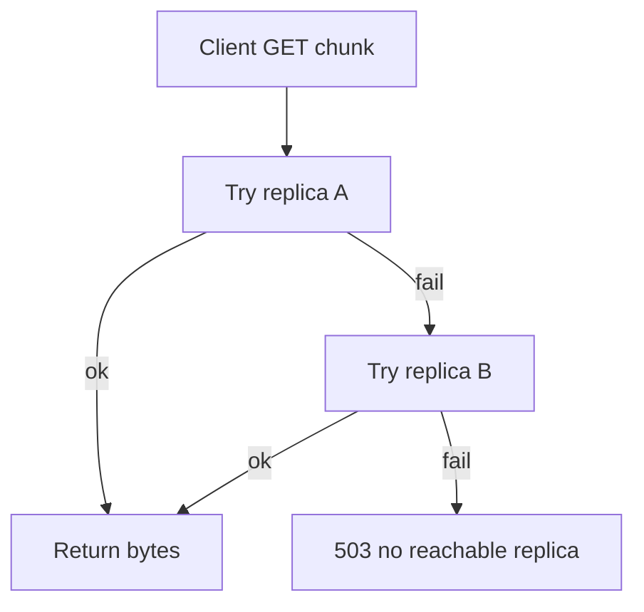

# Fault Tolerance Analysis

This document covers the four M5 fault-tolerance questions for the current implementation.

Primary references:
- [CONTRACT.md](../CONTRACT.md)
- [naming_server/app.py](../naming_server/app.py)
- [storage_server/main.py](../storage_server/main.py)
- [storage_server/storage.py](../storage_server/storage.py)

## Q1: One Storage Server Is Down

### What Happens

- Reads can still succeed if each requested chunk has at least one reachable replica.
- Writes can degrade or fail if available storage servers drop below the replication factor.

### Why

- Contract behavior requires trying the other replica when one read path fails ([CONTRACT.md](../CONTRACT.md)).
- Naming placement enforces `len(servers) >= REPLICATION_FACTOR`; otherwise it returns `503` in `placement()` in [naming_server/app.py](../naming_server/app.py).
- Storage health endpoint remains available for live nodes via `/health` in [storage_server/main.py](../storage_server/main.py).

### Read Failover Flow

## Q2: Naming Server Is Down

### What Happens

- Client-facing file operations fail because placement, locate, and metadata registration all depend on naming endpoints.
- Storage servers may still answer direct `GET /chunk/{id}`, but file-to-chunk mapping is unavailable to clients.

### Why

- Naming server is the only metadata authority in this design (`files`, `chunks`, `storage_servers` created in `init_db()` in [naming_server/app.py](../naming_server/app.py)).
- Without naming, there is no authoritative source for chunk ordering and replica locations per file.

### Recovery

- If the naming process restarts and the SQLite database file remains intact, metadata becomes available again.
- If naming metadata storage is lost/corrupted, chunk bytes can remain on storage nodes but are not practically discoverable by filename.

## Q3: Replication Tolerance (`REPLICATION_FACTOR - 1`)

### Result

- Fault tolerance is per chunk: with default `REPLICATION_FACTOR=2`, each chunk can tolerate one replica loss.

### Why

- Placement assigns each chunk to two distinct storage IDs using round-robin offset logic in `placement()` in [naming_server/app.py](../naming_server/app.py).
- As long as one assigned replica remains reachable, that chunk can still be served.
- If both replicas for any chunk are unavailable, that chunk is unavailable, and full-file reconstruction may fail.

## Q4: Recoverable vs Data-Loss Scenarios

### Recoverable

- **Storage process crash, disk intact:** recoverable after process restart.
- **Interrupted writes:** mitigated by temp-file + `os.replace(...)` write path in `save_chunk()` in [storage_server/storage.py](../storage_server/storage.py).
- **Single node data loss with surviving replica:** recoverable in principle by re-copying from the remaining replica (not automated in current code).

### Data-Loss / Catastrophic Cases

- **Both replicas of a chunk lost:** that chunk is lost.
- **Naming metadata loss/corruption:** mapping from file name to chunk list is lost.
- **Client crash before `/register`:** already uploaded chunks may remain as unreferenced data because metadata registration did not complete.

## Current Limits Relevant To Fault Tolerance

- No background re-replication service.
- No replicated naming metadata store.
- No chunk checksum validation in API flow.
